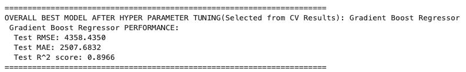
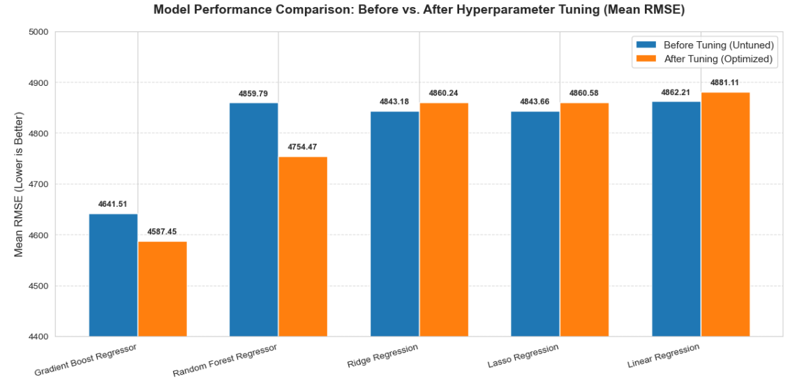
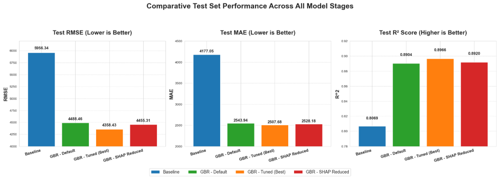

#  **Predicting Medical Insurance Cost for an Insurance Company**

✍ **Sreela Gopi**

## 📋 **Executive Summary**

#### **Project Goal:**
The goal of this project is to build a Machine Learning model that can predict medical expenses for customers for an Insurance company and provide insights into the major factors that contribute to higher insurance costs.

#### **Problem Context:**
Insurance companies invests a lot of time, effort, and money in creating models that accurately predicts health care costs.
The purposes of this project is to look into different features to observe their relationship to predict individual medical costs billed by health insurance.
### **Findings**

**Findings from Exploratory Data Analysis(EDA):**
1. **Age**: The distribution of age is quite varied.The average age of policy holders is 39 years. The data shows a wide range from a minimum of 18 to a maximum of 64 years.
2. **BMI**: The average BMI is around 30.6, which falls into the obese range (30.0 or higher) according to the WHO. The values range from 15.96 to 53.1
3. **Children**: The number of children per policyholder ranges from 0 to 5. The average number of children is 1 and a significant portion of the population has few to no children.
4. **Charges**: The average charges is 13,279.12. The standard deviation is very high, at 12,110.35 suggesting a large spread in costs. The minimum charge is 1,121.87 and the maximum is $63,770.42
5. **Sex**: The number of males and females is almost balanced, with 675 males and 662 females.
6. **Smoker**: The majority of the individuals are non-smokers (1063), while there are 274 smokers.
7. **Region**: The data is around evenly distributed across the four regions, with the southeast having the highest count at 364 individuals, followed by the southwest (325), northwest (324), and northeast (324).
8. **Charges vs. Age**: As people get older, their medical costs tend to increase.The data points appear to be grouped into distinct bands, which may suggest that other factors are having a significant impact at different age groups.
9. **Charges Vs. BMI**: Individuals with higher BMI values tend to have higher charges.
10. **Charges Vs. No. of Children**: There is no clear trend indicating that an increase in the number of children leads to a consistent increase in medical costs.
11. **Charges by Sex**: While charges are generally similar for both genders, some individuals face significantly higher costs.
12. **Charges by Smoker Status**: Smoking status is a major driver of charges.
13. **Charges by Region**: Charges are relatively similar across all four regions.
14. **Age Vs. Smoker**: Age does not appear to be a major factor in distinguishing smokers from non-smokers
15. **BMI Vs. Smoker**: Smokers tend to have a slightly lower average BMI compared to non-smokers.
16. **Smoker Vs. Region**: Region is a strong determinant of smoking status, with the Southeast region having the highest prevalence of smokers. This **looks to be the most important interaction**.
17. **Smoker Vs. Sex**: There is a slight tendency for males to be smokers more often than females in the dataset
18. **Region Vs. Children**: The number of people with zero children is the highest across all regions. The distribution of children counts (1 to 5) appears fairly similar and balanced across the four regions.
19. **Region Vs. Sex**: The distribution of the total count of individuals across the four regions is nearly identical. Gender is well-balanced within each region, suggesting no significant gender bias based on geography

**Findings from Model training and evaluation:**

The models used for training the data are **Linear Regression, Ridge Regression, Lasso Regression, Random Forest Regressor and Gradient Boost Regressor**.

The Cross Validation Results interpretation of the Hyperparameter tuned models are as below: 

**1. Overall Model Ranking and Selection**  

*  **Best Model:** The **Gradient Boost Regressor (GBR)** achieved the lowest error after tuning, with a Mean RMSE of $4587.45. This confirms it's the optimal model for this dataset.

* **Second Best:** The Random Forest Regressor is a respectable second at $4754.47.

* **Worst Performers:** All three linear models (Linear, Ridge, and Lasso) with errors around 4860 to 4881.

**2. Impact of Model Complexity**

* **Ensemble vs. Linear:** The best ensemble model (GBR) is approximately $273 lower in error than the best linear model (Ridge).

  This large gap suggests that the relationship between the features and the target variable is highly non-linear and involves complex feature interactions. Linear models cannot capture this complexity, whereas GBR and Random Forest thrive on it.

Test set forpermance of the best model selected Gradient Boost Regressor is as below:  

 

#### **Conclusion:**  

**Best Model : Gradient Boosting Regressor** 🏆  
1. Gradient Boosting Regressor consistently outperformed the other models during cross-validation and demonstrated strong performance on the final, unseen test set.
2. A test RMSE of 4,358.44 and a test MAE of 2,507.68 are both very strong indicators of a high-performing model. It demonstrates that our chosen model, the Gradient Boosting Regressor, is both accurate on average and robust enough to handle the complexity and variability in the data.
3. A R2 score of 0.8966 explains nearly 90% of the variance in the target variable insurance charges. This is an excellent result and confirms that the feature engineering and the model's complex structure are highly successful in fitting the underlying patterns of the data.

### **Actionable Insights to Business**
**Actionable Insights from Univariate Analysis:** 
1. **Charges**: The insurance company should focus on risk management for high-cost individuals. Since a small portion of the policyholders accounts for a disproportionately large share of the total medical costs, developing targeted programs for those groups could significantly reduce overall payout.
2. **Age**: The age distribution of policyholders is fairly even. So the compoany's marketing strategies must be appealing to all age groups.
3. **BMI**: The average BMI is approximately 30, which falls into the obese category. The data also has outliers with extremely high BMI values.
        This indicates a potential public health concern within the customer base. The insurance company could introduce wellness programs           or rewards to encourage healthy habits among policyholders.
4. **Smoker**: Around 20% of policyholders are smokers which could lead them to serious health issues. The company could design policies with higher premiums for smokers to accurately reflect their higher risk profile. Additionally, offering smoking cessation programs could be a strong value-add for customers.
5. **Region**: The customer base is fairly evenly distributed across the four geographical regions. There's no single dominant region. The company can develop region-specific strategies,for example, a region with a higher average BMI might be targeted with specific wellness programs.
6. **Children**: The majority of policyholders do not have children, while a smaller portion has one or two children. The maximum number of children is five. The company can develop personalized product recommendations based on a policyholder's family structure.
7. **Sex**: There is a nearly equal distribution of male and female policyholders, with males making up slightly more of the total population
            There could be some strategies developed if there is any difference in average charges among males and females.

**Actionable Insights from Bivariate Analysis:** 
1. **Impact of Smoker status on Charges**: Smoking status is a primary driver of their insurance costs. Insurance company could develop targeted wellness programs to encourage smoking cessation. Offering premium discounts or other rewards for non-smokers could also be a strategy to manage costs and promote healthier lifestyles among policyholders. This could lead to a potentially lower future claims.
2. **The Minimal Impact of Sex and Region**: There is no significant difference in medical charges between genders or across regions, these factors are not strong predictors of charges. So the insurance company could focus of other factors primarily.
3. **Target Gigh-risk regions for smoker intervention**: The interaction between the Southeast region and smoker status should be treated as a high-risk group that requires the highest pricing adjustment.
4. **Addressing Potential Bias**: The lower BMI in smokers might be due to smoking's effect on metabolism. Health interventions must not be focusing solely on BMI as the primary metric for smokers, but rather prioritize cessation first, while monitoring for potential post-cessation weight gain which is a common side effect.

**Actionable Insights from Model Evaluation**: 

Here are the key business takeaways from the model performance:

1. **Prioritize Customers with High Predicted Value**: Since the model predicts the insurance charges with high accuracy (R^2≈0.90), the company should use the model to rank customers by predicted value. 
2. **Budgeting and Risk**: The insurance company can use the MAE as a margin of error for expected revenue, making financial projections more realistic.
3. **Address High-Risk Outliers**: The significant gap between RMSE (≈$4358) and MAE (≈$2508) shows the model struggles with a small but impactful group of high-value, or high-variance customers. So, The company should investigate these specific outlier predictions. This may lead to finding new features not currently in the dataset. Improving data on these outliers will reduce RMSE and increase trust in the model's highest-value predictions.
4. **Confirm Success of Non-Linear Features**: The massive performance gain achieved by the Gradient Boost Regressor over linear models confirms that the feature interactions and engineered non-linear features are critical.
The company must ensure these successful features are consistently collected and maintained for all future marketing efforts.
5. **Standardize on GBR**: The evaluation proves the Gradient Boost Regressor is the best model. All future analytical development should prioritize GBR models.
6. **Avoid Excessive Feature selection:** The decrease of performance after feature selection suggests that even features with low individual importance still contribute collectively to the final, optimal result. So, The Insurance company should continue to use the full feature set for deployment to maintain the highest accuracy (R^2=0.8966) and avoid sacrificing predictive power for minimal simplicity gains.

## 🎯 **Rationale**
The rationale for this Medical Insurance Prediction data problem is primarily driven by the need for accurate financial forecasting and risk assessment within the healthcare and insurance industries. The core objective is to predict the cost of medical claims (charges) for individuals based on their demographic and health-related features and thus achieve:

*  **Accurate Premium Pricing**: By accurately predicting the average annual medical charges, the company can set competitive premiums that are high enough to cover costs but low enough to attract customers.
*  **Risk Management**: By identifying the drivers of the high cost, company can categorize high-risk customers and take required measures.

* **Business Strategy**: Help companies plan and execute targeted marketing strategies.

## 🔎 **Research Question**

This whole project could be boiled down to the following research question:

* **What contributes to a higher insurance cost?**

## 🗂️ **Data Sources**
The dataset used in this project is sourced from Kaggle and can be accessed [here](https://www.kaggle.com/datasets/rahulvyasm/medical-insurance-cost-prediction)

## ⚙️ **Methodology**

This project follows **CRISP-DM** framework. The methodologies used within this framework are:
1. **Data Understanding**
    * **Exploratory Data Analysis (EDA)** : EDA is performed to understand the data's structure, identify key variables influencing costs, and detect necessary data cleaning or transformation steps before modeling.
2. **Data Preparation**
    * **Train/Test split**: Training data is split before data preprocessing in order to prevent data leakage
    * **One-Hot Encoding**: For encoding categorical features to numerical.
    * **Feature Engineering**: Exploring if new informative columns can be created from the existing columns which can be important in deciding the insurance charges and improve the performance of the model.
    * **Polynomial Transformation**: To capture the non-linear relationship between the features and target variable.
3. **Modeling**:
    * **Model Training**: Linear Regression, Ridge Regression, Lasso Regression, Random Forest Regressor, Gradient Boost Regressor
    * **Hyper Parameter Tuning (GridSearchCV)**: To find the optimumn parameters of the models for the best performance.
    * **k-fold Cross Validation**: For a more reliable estimate of the models' performance on unseen data than a simple train-test split.
    * **Feature Selection - SHAP**: To select the most relevant features based on the feature importance.
4. **Evaluation**:
    * **Evaluation Metrics**: RMSE, MAE, R^2

## 📈 **Results**
Here is the detailed comparison and interpretation of the Cross Validation results before and after hyperparameter tuning,  and selecting the best performing model. 

 

#### **Key Findings:** 

The visualization clearly compares the performance of five different regression models before and after hyperparameter tuning, using the Mean RMSE (Root Mean Squared Error) as the primary metric.

**1. Overall Model Ranking and Selection**  

*  **Best Model:** The **Gradient Boost Regressor (GBR)** achieved the lowest error after tuning, with a Mean RMSE of $4587.45. This confirms it's the optimal model for this dataset.

* **Second Best:** The Random Forest Regressor is a respectable second at $4754.47.

* **Worst Performers:** All three linear models (Linear, Ridge, and Lasso) with errors around 4860 to 4881.

**2. Impact of Model Complexity**

* **Ensemble vs. Linear:** The best ensemble model (GBR) is approximately $273 lower in error than the best linear model (Ridge).

  This large gap suggests that the relationship between the features and the target variable is highly non-linear and involves complex feature interactions. Linear models cannot capture this complexity, whereas GBR and Random Forest thrive on it.

**3. Effectiveness of Hyperparameter Tuning**

* **Gradient Boost & Random Forest**: RMSE Decreased (Improved)
* **Linear Models**: RMSE Increased (Worsened)

Below is the test set performance across all model stages. 

 

#### **Key Findings:**  

**1. Gradient Boost Regressor (GBR) Dominates**: The transition from the Baseline (blue bar) to any Gradient Booster model (green, orange, red bars) shows a massive drop in error (RMSE/MAE) and a significant jump in R^2). This confirms that the non-linear and interaction features are critical.

**2. Hyperparameter Tuning Success**: The GBR - Tuned (Best) model (orange bar) achieves the lowest RMSE and MAE, and the highest R^2, demonstrating that tuning the hyperparameters successfully achieved the maximum performance out of the full feature set.

**3. Feature Selection Trade-off**: The GBR - SHAP Reduced model (red bar) is visibly worse (higher RMSE/MAE and lower R^2) than the GBR - Tuned (Best) model. This shows that even the features with the lowest SHAP scores provided enough unique predictive power that they should have been kept to maximize accuracy.

## 🌱 **Next steps**
1. **Deployment preparation**: Tuned Gradient Boost Regressor model is the winner in the model selection with R^2 score of around 90%. Next steps must be praparation for Deployment into the real world. There should be a performance monitoring setup as well.
2. **Focus on Outliers**: The large gap between the best RMSE (4358) and MAE (2508) indicates significant outlier issues that need investigation.
3. **Continuous Feature Enhancement**: Based on the outlier analysis as said above, prioritize collecting new, domain-specific data that might explain the current large errors.

## 📝 **Outline of project**

The Jupyter Notebook containing the analysis of the problem can be found here: [Notebook](https://github.com/sreela-gopi/Capstone_Assignment/blob/main/Capstone_Assignment_Initial_Report.ipynb) 
The dataset provided for the analysis can be found here : [Dataset](https://github.com/sreela-gopi/Capstone_Assignment/blob/main/data/medical_insurance.csv)

### ℹ️ **Contact and Further Information**

#### **Tech Stack:**

**Python:** Pandas, NumPy, scikit-learn  
**Data Visualization:** Matplotlib, Seaborn

This assignment was completed as part of the Capstone Assignment of Professional Certificate in Machine Learning & Artificial Intelligence - 2025, under the supervison of Learning Fecilitator Ms.Viviana Márquez
